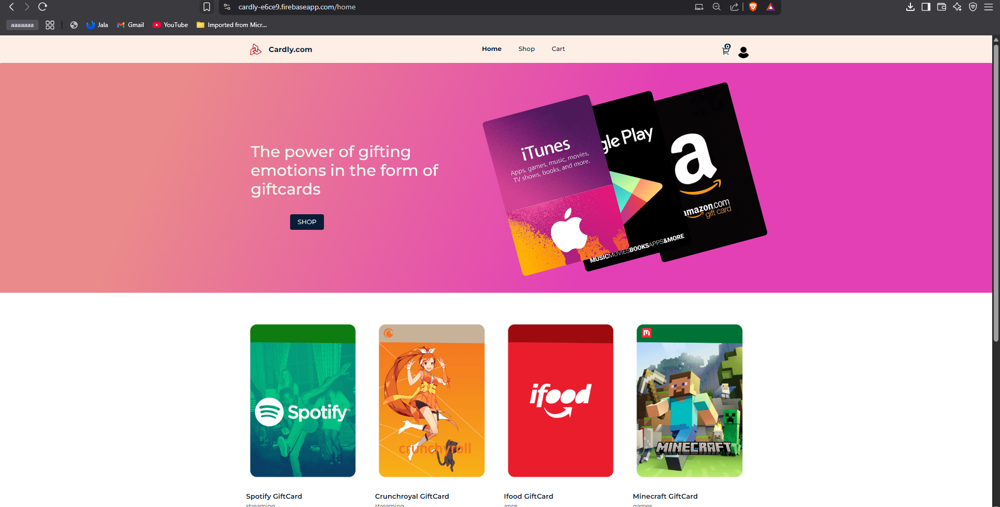
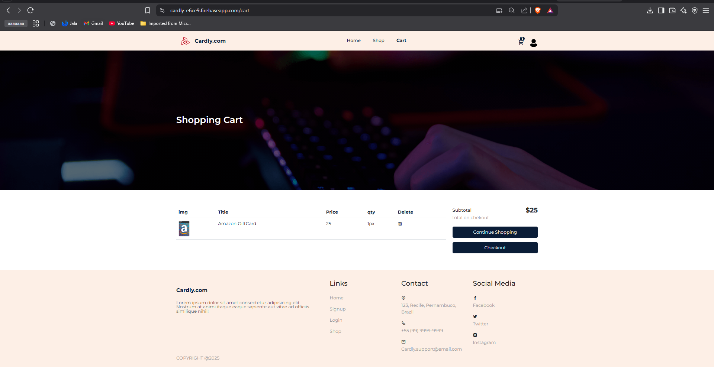
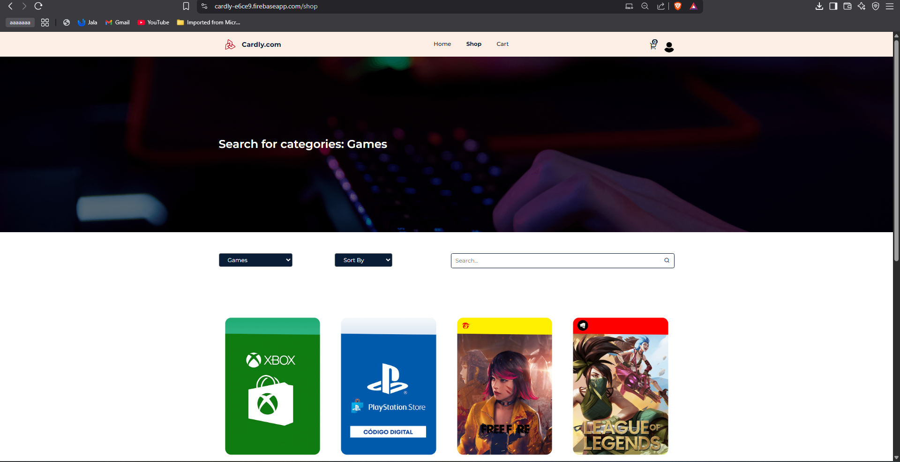

# 🎁 Cardly – Loja de Gift Cards

**Cardly** é uma aplicação web moderna desenvolvida com React que simula uma loja de cartões-presente (gift cards). É um projeto de portfólio focado em boas práticas de desenvolvimento front-end, experiência do usuário e integração com serviços externos.

🔗 **Deploy online**: [https://cardly-e6ce9.firebaseapp.com/](https://cardly-e6ce9.firebaseapp.com/)

---

## 📌 Visão Geral

O Cardly permite que usuários explorem, visualizem detalhes e simulem a compra de diversos gift cards populares — como Spotify, Amazon, PlayStation, Steam e mais.

O projeto foi desenvolvido com foco em:

- Arquitetura limpa e componentizada
- Uso eficiente do Redux para gerenciamento de estado
- Integração com Firebase (autenticação e deploy)
- Interface responsiva e agradável

---

## ✨ Funcionalidades

- ✅ Página inicial com destaques e banners
- ✅ Loja com catálogo de produtos
- ✅ Detalhes individuais de cada gift card
- ✅ Carrinho de compras com adição e remoção de itens
- ✅ Página de checkout
- ✅ Autenticação de usuários (login/cadastro)
- ✅ Rotas protegidas para áreas restritas

---

## 🛠️ Tecnologias e Ferramentas

- **React**
- **React Router**
- **Redux Toolkit**
- **Firebase Authentication & Hosting**
- **CSS Modules**

---

## 🚀 Como Executar Localmente

```bash
git clone https://github.com/heyluannlucas/CardlyReactProject.git
cd CardlyReactProject
npm install
npm start
```

> 📌 Antes de rodar, insira suas configurações do Firebase em `src/firebase.config.js`.

---

## 📸 Capturas de Tela 








---

## 📚 Aprendizados

Durante o desenvolvimento do Cardly, aprofundei conhecimentos em:

- Estruturação de aplicações SPA
- Boas práticas com Redux
- Firebase como backend-as-a-service
- Organização modular de componentes

---

## 👤 Autor

Desenvolvido com 💙 por **Luann**

🔗 [Deploy do projeto](https://cardly-e6ce9.firebaseapp.com/)

---

## 📝 Licença

Este projeto está licenciado sob a licença MIT.
